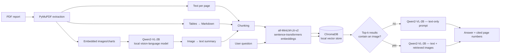

# 📡 Multimodal RAG on the Ooredoo Annual Report
A multimodal Retrieval-Augmented Generation (RAG) pipeline that
answers questions about a PDF annual report — text, tables, *and* charts/images —
using only open-source models.

> Demo document: Ooredoo Group Annual Report. Swap in any PDF (financial report,
> thesis, research paper...) by changing one variable.

---


## Architecture



One model (**Qwen2-VL-2B-Instruct**) handles both the image-captioning step
*and* the final answer generation (text-only or text+image), which keeps the
whole pipeline to a single ~4 GB model instead of juggling two separate LLMs.

## stack

| Component | Tool | Why it's free |
|---|---|---|
| PDF parsing (text + tables + images) | `PyMuPDF` (fitz) | Open source, local |
| Vision-language model (image captioning + multimodal answers) | `Qwen/Qwen2-VL-2B-Instruct` | Open weights, runs on Kaggle's free T4/P100 |
| Text embeddings | `sentence-transformers/all-MiniLM-L6-v2` | Open weights, local |
| Vector store | `ChromaDB` (local persistent client) | No hosted service, no account, no quota |
| Compute | Kaggle Notebooks | 30h/week GPU quota |


## Repo contents

```
.
├── README.md
├── requirements.txt          # for running locally instead of on Kaggle
├── notebook.ipynb            # offline indexing pipeline, Kaggle-ready
├── space-static/            
│   ├── index.html / style.css / script.js
│   └── data/, images/          # index.json + images go here
└── .gitignore
```

## Live demo (Hugging Face Space)


## Running it on Kaggle (recommended)

1. Create a new Kaggle Notebook, enable **GPU (T4 x1 or P100)** under
   Settings → Accelerator.
2. Upload your PDF as a Kaggle **Dataset** (or just "Add Data" → upload file)
   and note its path, e.g. `/kaggle/input/annual-report/report.pdf`.
3. Upload `notebook.ipynb` to Kaggle (File → Import Notebook), or copy its
   cells into a new notebook.
4. In the config cell, set:
   ```python
   PDF_PATH = Path("/kaggle/input/annual-report/report.pdf")
   ```
5. Run all cells. First run downloads the two models from Hugging Face
   (~4–5 GB total) — this only happens once per session.
6. Ask questions with `ask_rag("your question here")`.

## Running it locally

```bash
python -m venv .venv && source .venv/bin/activate
pip install -r requirements.txt
jupyter notebook notebook.ipynb
```

A GPU is strongly recommended (8 GB+ VRAM) but the notebook will fall back to
CPU — it will just be slower for the vision model.

## How it works

1. **Extraction** — every page is parsed for raw text, tables (converted to
   Markdown), and embedded images, each tagged with its page number.
2. **Captioning** — every extracted image (chart, diagram, photo) is sent to
   the local vision-language model with a prompt asking for the key
   values/trends/relationships it shows. That caption becomes retrievable
   text, while the original image is kept on disk for later.
3. **Indexing** — text, table, and caption chunks are embedded with
   MiniLM and stored in a local ChromaDB collection, tagged with page number
   and modality.
4. **Retrieval** — a question is embedded and the top-k most similar chunks
   are pulled back, regardless of modality.
5. **Answering** — if any retrieved chunk is an image caption, the original
   image is re-attached and sent to the vision-language model alongside the
   text context, so the model can "look" at the chart again before
   answering. Otherwise it answers from text context alone.
6. Every answer cites the page number(s) it drew from.


## License

MIT — do whatever you want with it, attribution appreciated.
